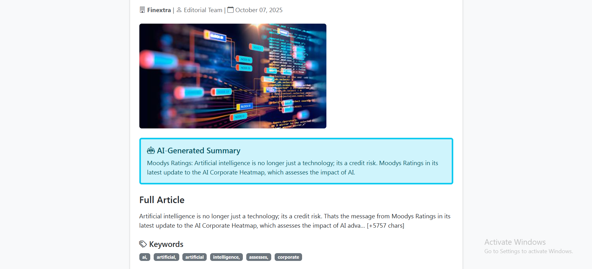

# AI-Powered News Aggregator

A full-stack web application that fetches, summarizes, and personalizes news articles using AI and natural language processing.

## Features

- **AI Summarization**: Automatic article summaries using Facebook's BART transformer model
- **Keyword Extraction**: TF-IDF-based keyword extraction from articles
- **Trending Topics**: Real-time analysis of most mentioned keywords across recent news
- **Personalized Feed**: Content recommendations based on reading history and preferences
- **Smart Search**: Multi-field search across titles, content, summaries, and keywords
- **Category Filtering**: Browse articles by topic (Technology, Business, Sports, etc.)

## Technologies Used

- **Backend**: Python, Django
- **NLP/AI**: Transformers (BART), NLTK, scikit-learn, PyTorch
- **Frontend**: HTML5, Bootstrap 5, Django Templates
- **Database**: SQLite (development), PostgreSQL (production)
- **APIs**: NewsAPI integration

## Live URL
https://ai-news-aggregator-afup.onrender.com

## Installation

1. Clone the repository:
```bash
git clone https://github.com/YOUR-USERNAME/ai-news-aggregator.git
cd ai-news-aggregator
```

2. Create virtual environment and install dependencies:
```bash
python -m venv venv
venv\Scripts\activate  # Windows
pip install -r requirements.txt
```

3. Run migrations:
```bash
python manage.py migrate
```

4. Create superuser:
```bash
python manage.py createsuperuser
```
5. Run the development server:
```bash
python manage.py runserver
```
6. Visit http://127.0.0.1:8000/

## Environment Variables
Create a .env file (not included in repo):
- SECRET_KEY=your-secret-key
- DEBUG=True
- NEWSAPI_KEY=your-newsapi-key

## Project Structure
articles/ - Main Django app containing models, views, and NLP utilities
news_fetcher.py - NewsAPI integration with automatic NLP processing
nlp_utils.py - BART summarization and TF-IDF keyword extraction
trending.py - Trending topics analyzer
recommendations.py - Personalized recommendation algorithm


